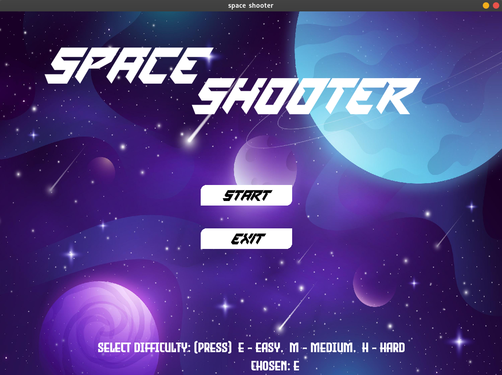
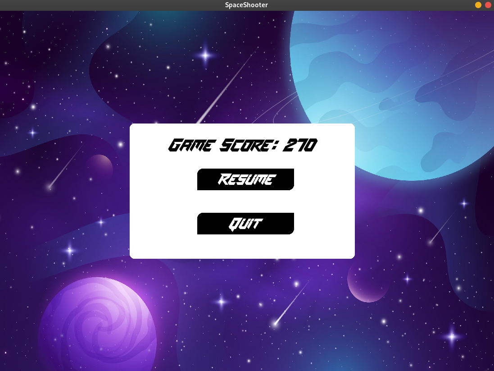
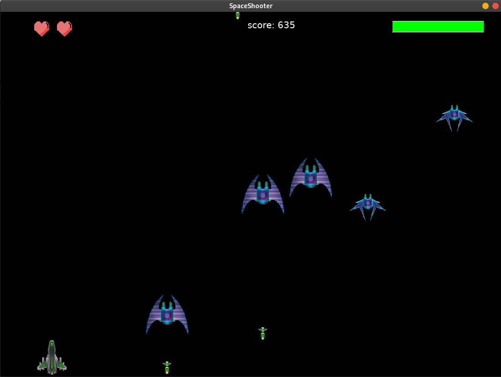
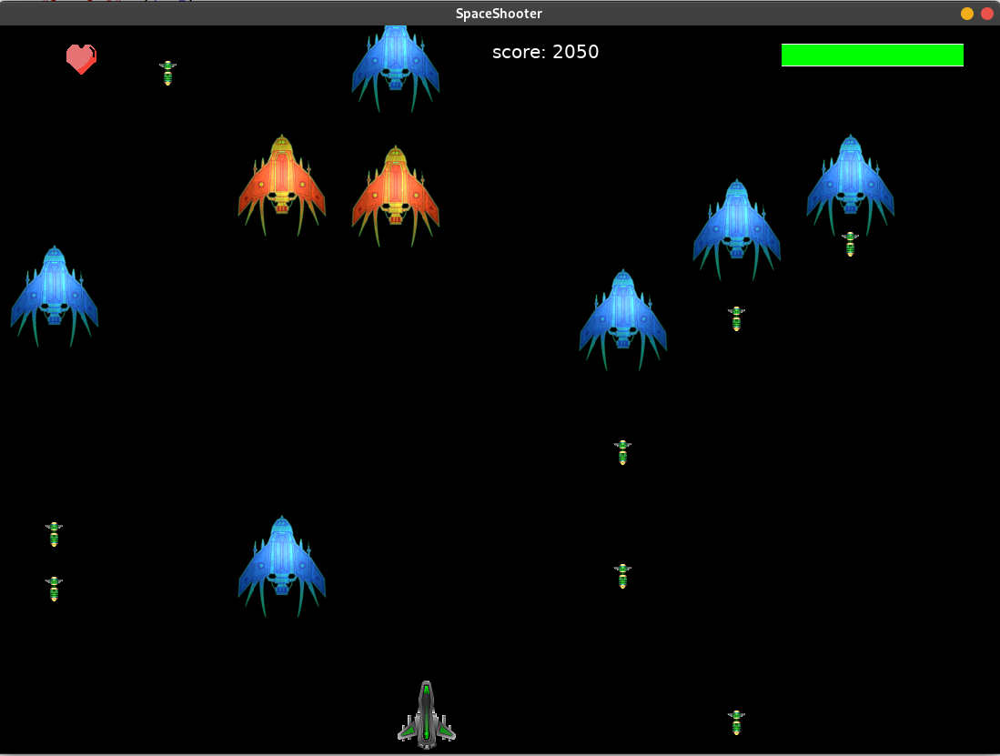
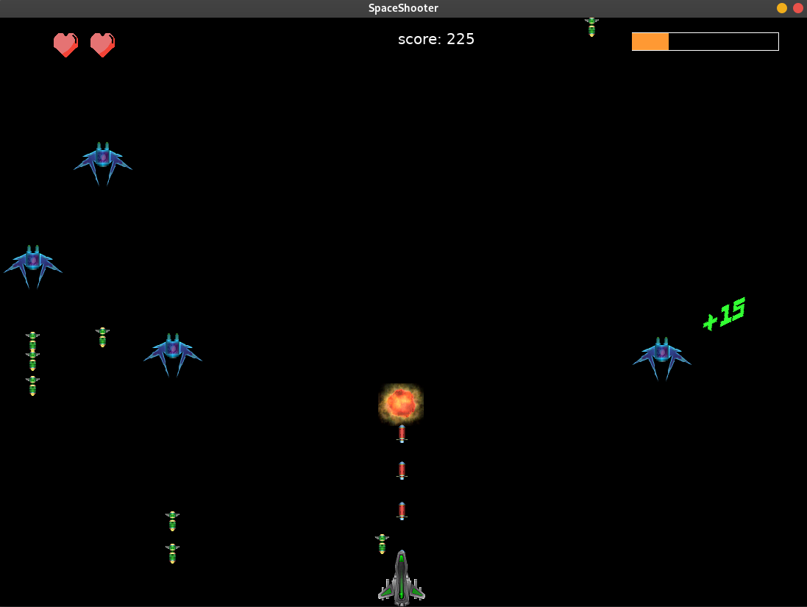
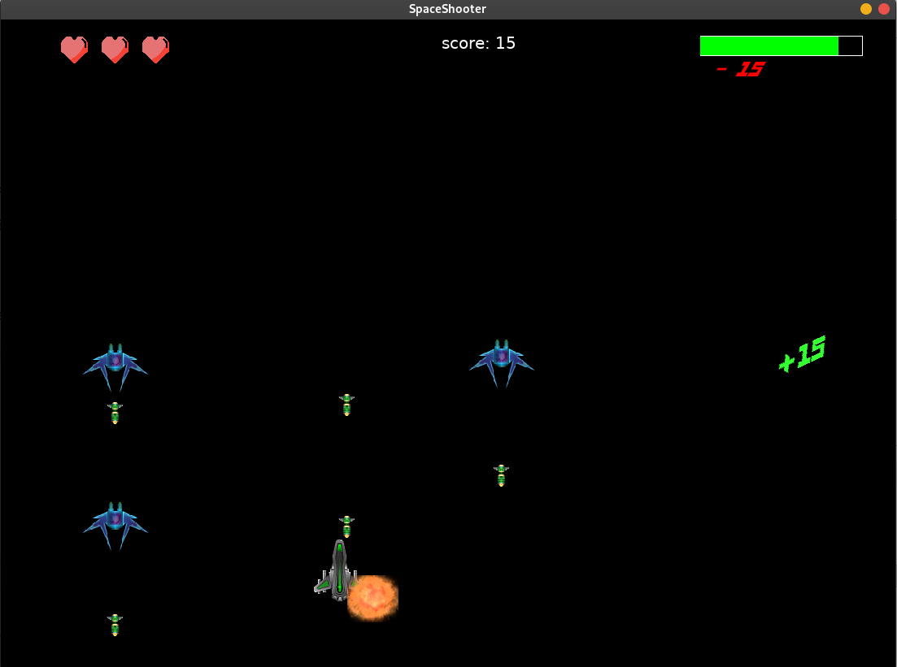

# Space-Shooter-pygame

**Space Shooter** is an alien shooting game created using <a href="https://www.python.org/">python</a> and <a href="https://www.pygame.org/news">pygame</a>.

This was my first project after learning pygame, and it helped me a lot to explore and expand my knowledge on programming skills.

## Instructions

### To play the game:

Run the `main.py` file from the repository root.

- **on windows:** py main.py

    
- **on unix/linux:** python3 main.py

## Dependencies

If running from source then dependencies can be installed from the `requirements.txt` file.

## Screenshots

## Credits

### Assets:

  - spaceships: https://gamesupply.itch.io/256-spaceships `[Author: GameSupplyGuy (https://gamesupply.itch.io/)]`
  - Explosion Animations: https://weisinx7.itch.io/fireball-explosion-sprites `[Author: weisinx7 (https://weisinx7.itch.io/)]`
  - Missiles: https://craftpix.net/freebies/free-space-shooter-game-objects/
  - SpaceMission Font: https://www.fontspace.com/space-mission-font-f56190 `[Designed by: Maknastudio]`
  - EvilEmpire Font: https://www.fontspace.com/evil-empire-font-f41587 `[Designed by: Tup Wanders]`
  - Background Image: <a href='https://www.freepik.com/vectors/galaxy-wallpaper'>Galaxy wallpaper vector created by freepik - www.freepik.com</a> `[Author: freepik]`
  - Game Life Image: <a href="https://www.flaticon.com/free-icons/pixel" title="pixel icons">Pixel icons created by apien - Flaticon</a> `[Author: apien]`